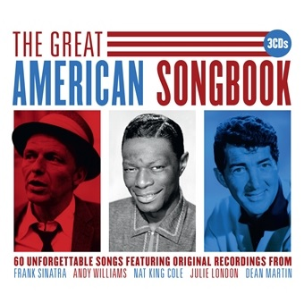

# Capstone Project
 
[Photo Source](https://www.demonmusicgroup.co.uk/catalogue/releases/the-great-american-songbook/) 
## Problem Statement

Over the last hundred years popular music has changed dramatically. From the instruments used to the chord progressions that give the foundation of a song. This project is to discover how differently musical lyrics have changed over time. During the 20's, 30's, and 40's many musicians all performed the popular songs of the day that came from musicals. Today these great songs are known as 'The Great American Songbook.' I am interested to find out what makes these lyrics characteristically different to the music in Walt Disney films. I will use classification models to predict which category the lyrics are from and use precision and recall as success metrics. 

Reference for composers to look up https://archive.org/details/americanpopulars00alec/page/23

All lyrics have been scraped from 
https://www.lyricsfreak.com/
http://www.disneyclips.com/lyrics/

Sources:

“The Great American Songbook”:

https://thesongbook.org/

https://en.wikipedia.org/wiki/Great_American_Songbook#Songwriters_and_songs

https://www.udiscovermusic.com/in-depth-features/cover-to-cover-the-story-of-the-great-american-songbook/

Disney and the Disney Renaissance:

https://en.wikipedia.org/wiki/Disney_Renaissance

https://www.youtube.com/watch?v=JX0gZY9VKlM
